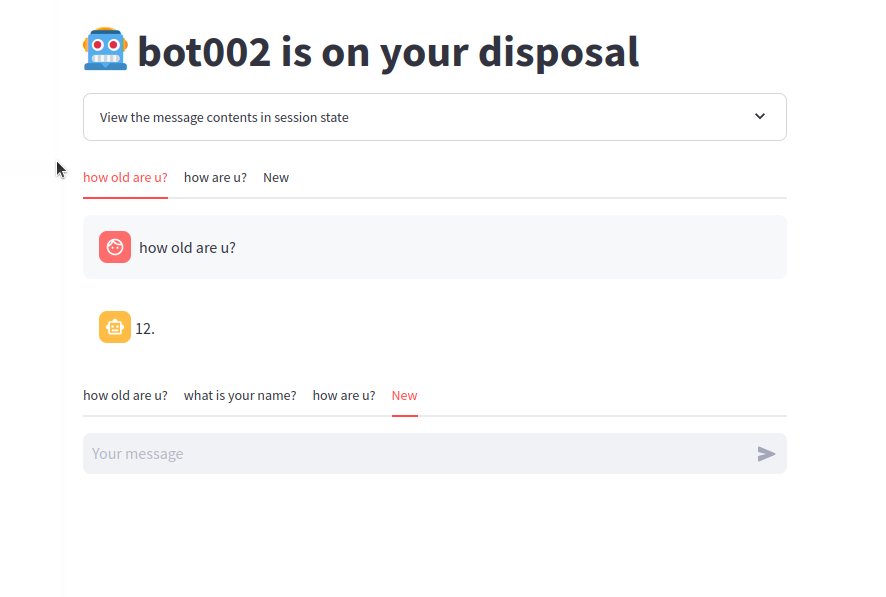

Chat in multiple sequences
------

Multiple sequences in parallel, with independent kv cache (by modifying llama.py in llamacpp package), namely fast response from LLM after the first round, and independent memory without injecting chat history.  
Use streamlit as front-end webpage engine, create a nested tab display and a load/save history module in json. Supported by llamacpp and streamlit, may be integrated into langchain or llamaindex in the future.

Note: I removed the shared lib in llama_cpp_0.2.75 to save space, and only modified llama.py to enable self-extend and multi-sequence chat.

To do
-------
- [ ] more control on kv cache of each sequence.  
- [ ] make deleting sequence possible
- [ ] integrate more tools (like bot001)